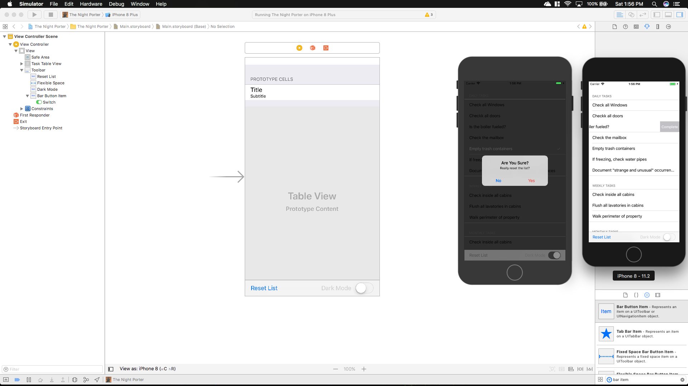
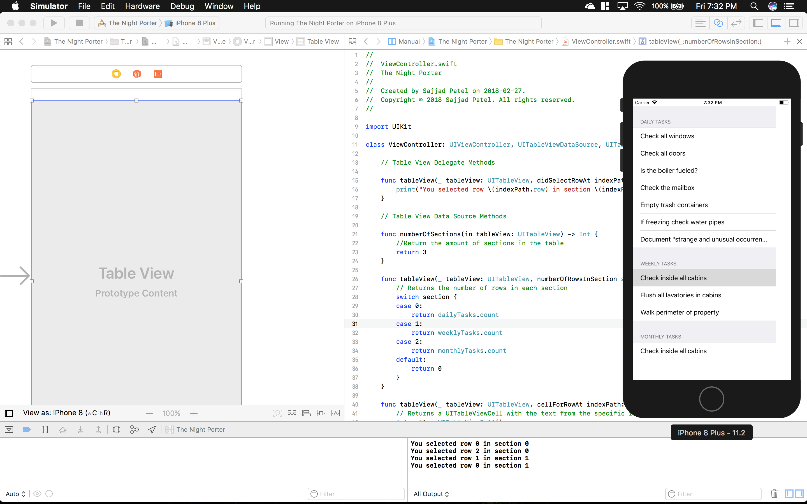
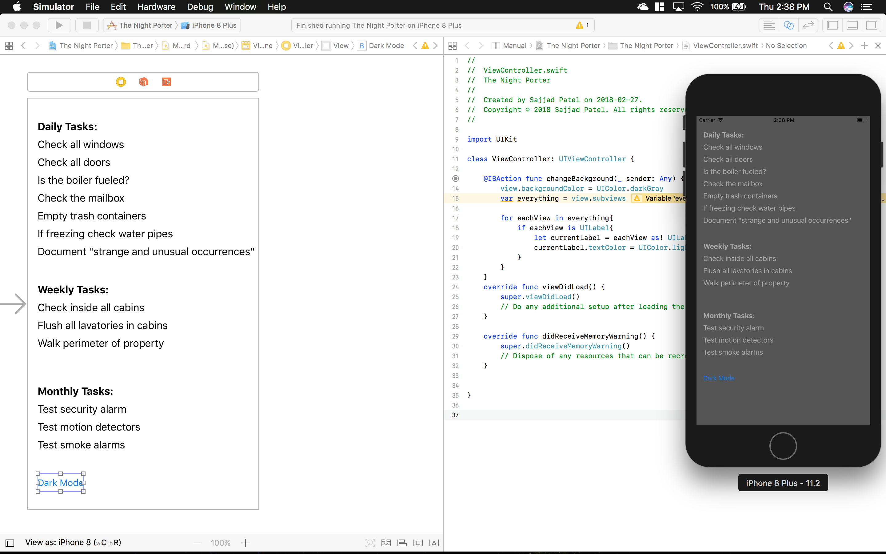

# NPREADME
PluralSight iOS Tutorial Night Porter

## Repo Description
Utilized Swift, Auto Constraint, UITableViewDelegate, UIActionController, UIAction, UIContextualAction and XCode to build an app for iOS devices that tracks tasks needed to be done in a camping ground.

## Completed

## UPDATE 3

## UPDATE 2

## UPDATE 1

## INITIAL

